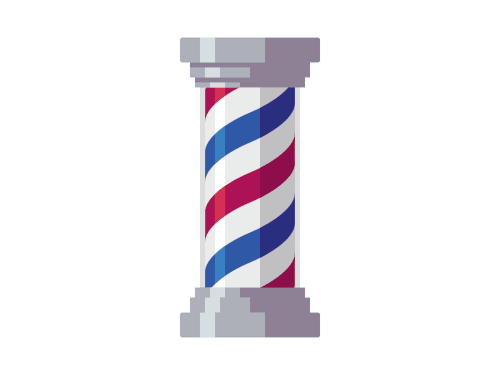

<p align="left">
   
</p>

# Go Barber


[](https://github.com/LauraBeatris)
[](#)
[](https://github.com/LauraBeatris/gobarber-mobile/stargazers)
[](https://github.com/LauraBeatris/gobarber-mobile/network/members)
[](https://github.com/LauraBeatris/gobarber-mobile/graphs/contributors)

> Provide to users an easy and fast way to schedule appointments in barber shops

---

# :pushpin: Table of Contents

* [Features](#rocket-features)
* [Installation](#construction_worker-installation)
* [Getting Started](#runner-getting-started)
* [FAQ](#postbox-faq)
* [Found a bug? Missing a specific feature?](#bug-issues)
* [Contributing](#tada-contributing)
* [License](#closed_book-license)

# :construction_worker: Installation

**You need to install [Node.js](https://nodejs.org/en/download/), [Yarn](https://yarnpkg.com/), [Android SDK](https://medium.com/surabayadev/setting-up-react-native-android-without-android-studio-35a496e1dfa3) first and then, in order to clone the project via HTTPS, run this command:**

```git clone https://github.com/LauraBeatris/gobarber-mobile.git```

SSH URLs provide access to a Git repository via SSH, a secure protocol. If you have a SSH key registered in your Github account, clone the project using this command:

```git clone git@github.com:LauraBeatris/gobarber-mobile.git```

**Install dependencies**

```yarn install```

Create your enviroment variables based on the examples of ```.env.example```

```cp .env.example .env```

After copying the examples, make sure to fill the variables with new values.

**Setup the API**

The interface needs to interact with the server to execute mutations related to check-ins and questions.

Make sure to go to the [Hotseat](https://github.com/LauraBeatris/hotseat) repository and follow the instructions in order to get it running in your machine.

# :runner: Getting Started

Run the following command in order to start the application in a development environment:

```
  // Install the application in a android device
  react-native run-android

  // Start the application
  yarn start
```

# :postbox: Faq

**Question:** What are the tecnologies used in this project?

**Answer:** The tecnologies used in this project are [React Native](https://reactnative.dev/) + [Styled Components](https://styled-components.com/) to handle scoped CSS.

# :bug: Issues

Feel free to **file a new issue** with a respective title and description on the the [Gympoint Mobile](https://github.com/LauraBeatris/gobarber-mobile/issues) repository. If you already found a solution to your problem, **i would love to review your pull request**! Have a look at our [contribution guidelines](https://github.com/LauraBeatris/gobarber-mobile/blob/master/CONTRIBUTING.md) to find out about the coding standards.

# :tada: Contributing

Check out the [contributing](https://github.com/LauraBeatris/gobarber-mobile/blob/master/CONTRIBUTING.md) page to see the best places to file issues, start discussions and begin contributing.

# :closed_book: License

Released in 2019.
This project is under the [MIT license](https://github.com/LauraBeatris/gobarber-mobile/master/LICENSE).

Made with love by [Laura Beatris](https://github.com/LauraBeatris) 💜🚀
